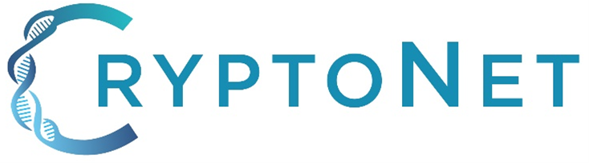

# CDCgov GitHub Organization Open Source Project Template

**Template for clearance: This project serves as a template to aid projects in starting up and moving through clearance procedures. To start, create a new repository and implement the required [open practices](open_practices.md), train on and agree to adhere to the organization's [rules of behavior](rules_of_behavior.md), and [send a request through the create repo form](https://forms.office.com/Pages/ResponsePage.aspx?id=aQjnnNtg_USr6NJ2cHf8j44WSiOI6uNOvdWse4I-C2NUNk43NzMwODJTRzA4NFpCUk1RRU83RTFNVi4u) using language from this template as a Guide.**

**General disclaimer** This repository was created for use by CDC programs to collaborate on public health related projects in support of the [CDC mission](https://www.cdc.gov/about/organization/mission.htm).  GitHub is not hosted by the CDC, but is a third party website used by CDC and its partners to share information and collaborate on software. CDC use of GitHub does not imply an endorsement of any one particular service, product, or enterprise. 

## Access Request, Repo Creation Request

* [CDC GitHub Open Project Request Form](https://forms.office.com/Pages/ResponsePage.aspx?id=aQjnnNtg_USr6NJ2cHf8j44WSiOI6uNOvdWse4I-C2NUNk43NzMwODJTRzA4NFpCUk1RRU83RTFNVi4u) _[Requires a CDC Office365 login, if you do not have a CDC Office365 please ask a friend who does to submit the request on your behalf. If you're looking for access to the CDCEnt private organization, please use the [GitHub Enterprise Cloud Access Request form](https://forms.office.com/Pages/ResponsePage.aspx?id=aQjnnNtg_USr6NJ2cHf8j44WSiOI6uNOvdWse4I-C2NUQjVJVDlKS1c0SlhQSUxLNVBaOEZCNUczVS4u).]_

## Related documents

* [Open Practices](open_practices.md)
* [Rules of Behavior](rules_of_behavior.md)
* [Thanks and Acknowledgements](thanks.md)
* [Disclaimer](DISCLAIMER.md)
* [Contribution Notice](CONTRIBUTING.md)
* [Code of Conduct](code-of-conduct.md)

## Overview

# This pipeline is currently under contruction and preparing for an initial alpha release.

## Introduction

`WaterGLASS` is a bioinformatics pipeline developed by CDC's [CryptoNet](https://www.cdc.gov/parasites/crypto/cryptonet.html) national surveillance program in the [Waterborne Disease Prevention Branch](https://www.cdc.gov/ncezid/dfwed/waterborne/).  This pipline QC's and de novo assembles genomes of the parasitic protist *Cryptosporidium*, automatically determines the species and subtype designation for input sequences, and calls sequence variants against a reference genome.  The pipeline accepts raw FASTQ data from Illumina short-read (shotgun) sequencing and returns a MultiQC report containing sequencing read quality metrics, taxonomic profiling of the input data, assembly and variant statistics, and specices/subtype designations. 

 

> [!NOTE]
> **Please note that the results produced by this pipeline are not ISO or CLIA-certified and should not be considered diagnostic.**

The pipeline is built using [Nextflow](https://www.nextflow.io), a workflow tool to run tasks across multiple compute infrastructures in a very portable manner. It uses Docker/Singularity containers making installation trivial and results highly reproducible. The [Nextflow DSL2](https://www.nextflow.io/docs/latest/dsl2.html) implementation of this pipeline uses one container per process which makes it much easier to maintain and update software dependencies. 

## Pipeline summary

The pipeline has numerous options to allow you to run only specific aspects of the workflow if you so wish. For example, for Illumina data you can skip the host read filtering step with Kraken 2 with `--skip_kraken2` or you can skip all of the assembly steps with the `--skip_assembly` parameter. See the [usage](https://nf-co.re/viralrecon/usage) and [parameter](https://nf-co.re/viralrecon/parameters) docs for all of the available options when running the pipeline.

## Credits

WaterGLASS was originally developed by [Shatavia Morrison](https://github.com/SMorrison42), [Anusha Ginni](https://github.com/aginnimb), [Krishna Thakor](https://github.com/kthakor0), and [Hunter Seabolt](https://github.com/hseabolt) as a fork of the [nf-core viralrecon pipeline](https://nf-co.re/viralrecon).  Many thanks to the viralrecon developers for providing a robust template!

## Public Domain Standard Notice

This repository constitutes a work of the United States Government and is not
subject to domestic copyright protection under 17 USC § 105. This repository is in
the public domain within the United States, and copyright and related rights in
the work worldwide are waived through the [CC0 1.0 Universal public domain dedication](https://creativecommons.org/publicdomain/zero/1.0/).
All contributions to this repository will be released under the CC0 dedication. By
submitting a pull request you are agreeing to comply with this waiver of
copyright interest.

## License Standard Notice

The repository utilizes code licensed under the terms of the Apache Software
License and therefore is licensed under ASL v2 or later.

This source code in this repository is free: you can redistribute it and/or modify it under
the terms of the Apache Software License version 2, or (at your option) any
later version.

This source code in this repository is distributed in the hope that it will be useful, but WITHOUT ANY
WARRANTY; without even the implied warranty of MERCHANTABILITY or FITNESS FOR A
PARTICULAR PURPOSE. See the Apache Software License for more details.

You should have received a copy of the Apache Software License along with this
program. If not, see http://www.apache.org/licenses/LICENSE-2.0.html

The source code forked from other open source projects will inherit its license.

## Privacy Standard Notice

This repository contains only non-sensitive, publicly available data and
information. All material and community participation is covered by the
[Disclaimer](DISCLAIMER.md)
and [Code of Conduct](code-of-conduct.md).
For more information about CDC's privacy policy, please visit [http://www.cdc.gov/other/privacy.html](https://www.cdc.gov/other/privacy.html).

## Contributing Standard Notice

Anyone is encouraged to contribute to the repository by [forking](https://help.github.com/articles/fork-a-repo)
and submitting a pull request. (If you are new to GitHub, you might start with a
[basic tutorial](https://help.github.com/articles/set-up-git).) By contributing
to this project, you grant a world-wide, royalty-free, perpetual, irrevocable,
non-exclusive, transferable license to all users under the terms of the
[Apache Software License v2](http://www.apache.org/licenses/LICENSE-2.0.html) or
later.

All comments, messages, pull requests, and other submissions received through
CDC including this GitHub page may be subject to applicable federal law, including but not limited to the Federal Records Act, and may be archived. Learn more at [http://www.cdc.gov/other/privacy.html](http://www.cdc.gov/other/privacy.html).

## Records Management Standard Notice

This repository is not a source of government records, but is a copy to increase
collaboration and collaborative potential. All government records will be
published through the [CDC web site](http://www.cdc.gov).

## Additional Standard Notices
Please refer to [CDC's Template Repository](https://github.com/CDCgov/template) for more information about [contributing to this repository](https://github.com/CDCgov/template/blob/main/CONTRIBUTING.md), [public domain notices and disclaimers](https://github.com/CDCgov/template/blob/main/DISCLAIMER.md), and [code of conduct](https://github.com/CDCgov/template/blob/main/code-of-conduct.md).

## Disclaimer

**General disclaimer** This repository was created for use by CDC programs to collaborate on public health related projects in support of the [CDC mission](https://www.cdc.gov/about/organization/mission.htm).  GitHub is not hosted by the CDC, but is a third party website used by CDC and its partners to share information and collaborate on software. CDC use of GitHub does not imply an endorsement of any one particular service, product, or enterprise. 

## Citations

An extensive list of references for the tools used by the pipeline can be found in the [`CITATIONS.md`](CITATIONS.md) file.

This pipeline uses code and infrastructure developed and maintained by the [nf-core](https://nf-co.re) community, reused here under the [MIT license](https://github.com/nf-core/tools/blob/master/LICENSE).

> **The nf-core framework for community-curated bioinformatics pipelines.**
>
> Philip Ewels, Alexander Peltzer, Sven Fillinger, Harshil Patel, Johannes Alneberg, Andreas Wilm, Maxime Ulysse Garcia, Paolo Di Tommaso & Sven Nahnsen.
>
> _Nat Biotechnol._ 2020 Feb 13. doi: [10.1038/s41587-020-0439-x](https://dx.doi.org/10.1038/s41587-020-0439-x).  
Shatavia## Public Domain Standard Notice
This repository constitutes a work of the United States Government and is not
subject to domestic copyright protection under 17 USC § 105. This repository is in
the public domain within the United States, and copyright and related rights in
the work worldwide are waived through the [CC0 1.0 Universal public domain dedication](https://creativecommons.org/publicdomain/zero/1.0/).
All contributions to this repository will be released under the CC0 dedication. By
submitting a pull request you are agreeing to comply with this waiver of
copyright interest.

## License Standard Notice
The repository utilizes code licensed under the terms of the Apache Software
License and therefore is licensed under ASL v2 or later.

This source code in this repository is free: you can redistribute it and/or modify it under
the terms of the Apache Software License version 2, or (at your option) any
later version.

This source code in this repository is distributed in the hope that it will be useful, but WITHOUT ANY
WARRANTY; without even the implied warranty of MERCHANTABILITY or FITNESS FOR A
PARTICULAR PURPOSE. See the Apache Software License for more details.

You should have received a copy of the Apache Software License along with this
program. If not, see http://www.apache.org/licenses/LICENSE-2.0.html

The source code forked from other open source projects will inherit its license.

## Privacy Standard Notice
This repository contains only non-sensitive, publicly available data and
information. All material and community participation is covered by the
[Disclaimer](DISCLAIMER.md)
and [Code of Conduct](code-of-conduct.md).
For more information about CDC's privacy policy, please visit [http://www.cdc.gov/other/privacy.html](https://www.cdc.gov/other/privacy.html).

## Contributing Standard Notice
Anyone is encouraged to contribute to the repository by [forking](https://help.github.com/articles/fork-a-repo)
and submitting a pull request. (If you are new to GitHub, you might start with a
[basic tutorial](https://help.github.com/articles/set-up-git).) By contributing
to this project, you grant a world-wide, royalty-free, perpetual, irrevocable,
non-exclusive, transferable license to all users under the terms of the
[Apache Software License v2](http://www.apache.org/licenses/LICENSE-2.0.html) or
later.

All comments, messages, pull requests, and other submissions received through
CDC including this GitHub page may be subject to applicable federal law, including but not limited to the Federal Records Act, and may be archived. Learn more at [http://www.cdc.gov/other/privacy.html](http://www.cdc.gov/other/privacy.html).

## Records Management Standard Notice
This repository is not a source of government records, but is a copy to increase
collaboration and collaborative potential. All government records will be
published through the [CDC web site](http://www.cdc.gov).

## Additional Standard Notices
Please refer to [CDC's Template Repository](https://github.com/CDCgov/template) for more information about [contributing to this repository](https://github.com/CDCgov/template/blob/main/CONTRIBUTING.md), [public domain notices and disclaimers](https://github.com/CDCgov/template/blob/main/DISCLAIMER.md), and [code of conduct](https://github.com/CDCgov/template/blob/main/code-of-conduct.md).
